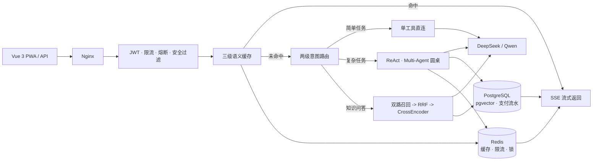

# AI Agent Gateway Showcase

一套可插拔的 Multi-Agent / RAG 网关：同一套引擎承载多业务场景，统一处理意图路由、知识检索、工具调用、流式回答、计费与可观测运维。当前落地民法典咨询与旅游规划，架构可迁移到企业知识库、合同审查、客服质检等企业服务场景。

[在线演示](https://the-world-agent.cloud) · [项目展示](showcase/README.md) · [核心代码导读](showcase/core/README.md)

## 项目定位

这个仓库重点展示三件事：

- **业务可复用**：Agent 引擎与业务配置分离。新增场景主要增加配置包，不复制一套网关。
- **答案可追溯**：知识问答走 pgvector 与 pg_trgm 双路召回、RRF 融合和 CrossEncoder 重排；回答引用法条，零召回直接拒答。
- **工程可交付**：除模型调用外，还包含 SSE 流式链路、认证限流、语义缓存、支付一致性、迁移、回滚和线上排障。

## 架构



业务属性通过配置包外置，包括人格、工具、模型策略和路由规则。核心执行层负责路由、ReAct 循环、并行协作、取消恢复、降级和结果聚合。

## 关键指标

| 维度 | 当前结果 | 口径与边界 |
|---|---|---|
| 业务复用 | 1 套引擎承载 2 类场景 | 旅游规划与民法典咨询；新增领域通过配置包接入 |
| 知识语料 | 民法典 1260 条约 10 万字 | 全量清洗入库；法条引用逐条回查，零召回拒答 |
| 检索质量 | holdout Recall@5 93.0% / Recall@10 99.3% / MRR 0.879 | 190 条法条级人工标注集；重排开启，自测结果 |
| 重排取舍 | 关闭后 holdout Recall@5 为 88.5% | 重排常驻约 1.1GB，2 核 1GB 环境下默认关闭，可按需恢复 |
| 一致性与计费 | 分布式锁 + 乐观锁 + 事务流水 + 补偿 | 幂等键防重复扣费；订单与流水同事务写入 |
| 部署与恢复 | 阿里云 2 核 1GB，单机 lite 栈 | 备份恢复演练 4 秒；本地 Compose 支持多实例与 Nginx 负载均衡 |
| 工程门禁 | 函数不超过 80 行，文件不超过 600 行 | 通过静态脚本检查；外部评测和业务指标均为自测 |

当前处于小范围内测阶段，真实用户量较小。仓库内性能、评测和恢复数据用于证明工程实践，不代表商业流量规模。

## Demo

- 在线体验：https://the-world-agent.cloud
- 项目说明：[showcase/README.md](showcase/README.md)
- 核心代码导读：[showcase/core/README.md](showcase/core/README.md)

## 核心代码索引

| 能力 | 代码入口 | 重点 |
|---|---|---|
| 可插拔路由 | [router.py](app/agents/router.py) / [routing_table.py](app/agents/routing_table.py) | 关键词快路由与模型兜底，业务路由规则外置 |
| Agent 执行 | [runner.py](app/agents/runner.py) | ReAct 循环、工具调用、步数控制、重试与降级 |
| 多 Agent 协作 | [orchestrator.py](app/agents/orchestrator.py) | 并行分析、交叉审阅、仲裁合成 |
| RAG 检索 | [kb_embedding.py](app/agents/kb_embedding.py) / [kb_rerank.py](app/agents/kb_rerank.py) | 向量与关键词召回、RRF 融合、本地重排 |
| 引用与拒答 | [civil_grounding.py](app/services/civil_grounding.py) | 法条溯源、引用校验、零召回不调用模型 |
| 流式网关 | [chat_stream_core.py](app/services/chat_stream_core.py) / [stream_utils.py](app/core/stream_utils.py) | SSE 分帧、工具分发、流式错误收口 |
| 语义缓存 | [semantic_cache.py](app/core/semantic_cache.py) | 多级缓存、上下文隔离键、抗雪崩 |
| 认证与保护 | [auth.py](app/middleware/auth.py) / [rate_limit.py](app/middleware/rate_limit.py) | JWT 轮换、Redis 分布式限流、熔断降级 |
| 支付一致性 | [service.py](app/payment/service.py) / [deduction.py](app/payment/deduction.py) / [refund.py](app/payment/refund.py) | 幂等、锁、事务、退款与补偿 |
| 前端流式交互 | [sse.ts](frontend/src/api/sse.ts) / [chat.ts](frontend/src/stores/chat.ts) | 跨 chunk 攒帧、序号守卫、会话状态管理 |

## 技术栈

Python · FastAPI · asyncio · PostgreSQL（pgvector / pg_trgm）· Redis · Vue 3 · TypeScript · Vite · Docker Compose · Nginx · SSE · DeepSeek / Qwen · Prometheus / Grafana / Loki / Tempo

## 仓库结构

```text
app/                 后端核心：agents / services / routing / payment / core
frontend/            Vue 3 前端与 SSE 流式交互
showcase/            面向招聘方的项目展示与核心代码导读
agent_docs/          脱敏后的 Bug 日志与修复台账
alembic/             数据库版本化迁移
deploy/              部署相关配置
tests/               测试与评测代码快照
可复用代码/           分布式锁、熔断器、单飞幂等、LRU+TTL、限流器
可复用资产/           跨项目模板、MCP 与技能资产
```

## 同步说明

本仓是脱敏展示快照，核心代码同步自私有主仓。修复台账随仓公开；评测语料、线上密钥、运维细节和内部复盘不进入公开仓库。对外数字只保留可解释、可追溯且明确标注为自测的口径。
