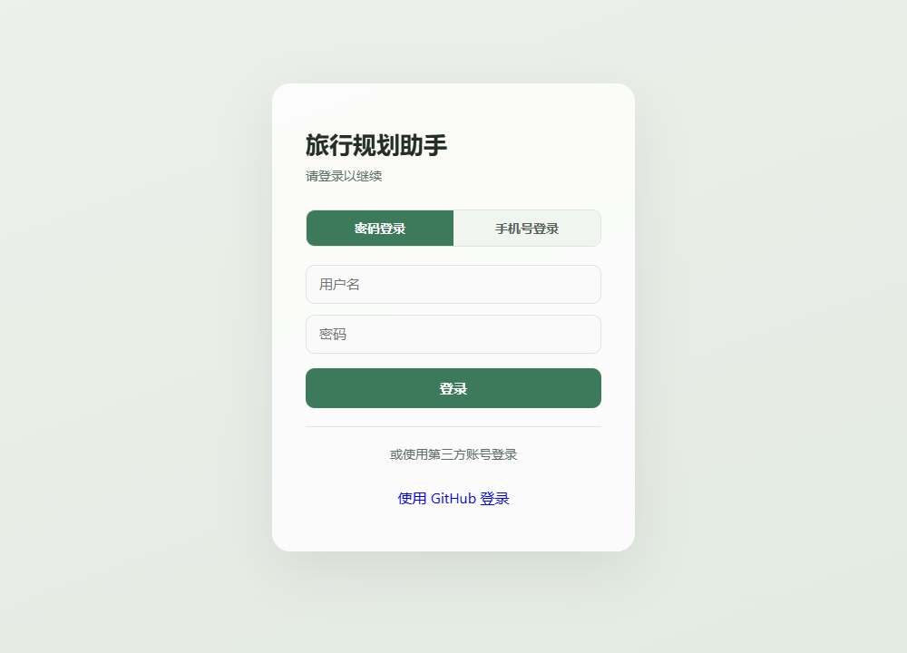

# AI Agent 网关 · 项目展示

> 这是一个个人工程训练与能力验证项目，不是商业产品。用一套已上线公网的 Multi-Agent 网关承载两类差异场景，当前处于小范围内测阶段；真实用户量很小，性能与评测数字均为自测。

---

## 项目是什么

用户提问进来，网关判断「该找谁回答」，分发给对应领域的 AI 助手，流式返回答案。当前用两个场景验证引擎边界：

- **旅游规划助手**：天气 / 酒店 / 路线 / 美食多 Agent 协作规划行程
- **民法典咨询助手**：基于 RAG 检索增强的法律知识问答，回答附法条出处

这两个场景是技术验证载体，不代表项目目标是把它们做成商业产品。

## 核心亮点

**一核双用、可插拔架构**
一套 Agent 引擎统一调度，各领域的人设、工具、模型策略全部外置为独立配置包。新增一个业务场景 = 新增一个配置包，核心代码零改动。

**Agent 引擎自研**
对标 LangChain ReAct / LangGraph 状态机思想，根据生产需求自研实现；配合语义意图路由与多 Agent 并行协作，简单问题快速响应、复杂问题深度求解。

**RAG 知识问答**
关键词与向量双通道召回 + 重排精排，回答附法条出处，支持跨法域正确引导（如「七天无理由退货」正确导向消费者权益保护法）。

## 工程能力

| 维度 | 内容 |
|---|---|
| 服务治理 | JWT 认证、Redis 分布式限流、熔断降级、SSE 流式输出 |
| 数据层 | 冷热分层记忆（Redis + PostgreSQL）、三级语义缓存 |
| 可观测 | OpenTelemetry 全链路追踪 + Prometheus/Grafana + Loki 日志关联 |
| 生产化 | 迁移先行 + 健康门禁的滚动发布、按 digest 回滚、数据库版本化迁移、SLO 与 27 条告警规则、备份恢复演练、脚本化的实例增减（上限 4 台） |

## 关键数据

- **检索质量**（民法典，自测）：190 条法条级人工标注问答集按 train / holdout 切分，重排开启时 holdout Recall@5 93.0%、Recall@10 99.3%、MRR 0.879；重排关闭时 Recall@5 降至 88.5%，据此把重排定位为质量组件而非默认链路
- **语料规模**：民法典 1260 条约 10 万字全量清洗入库（构建脚本条号正则漏了"千""零"两位，曾导致 861 条后整编缺失，已补全）
- **代码规模**：主仓 Python 约 2.5 万行 / 120 个模块，前端约 8500 行；函数与文件行数上限由 AST 脚本校验，908 个函数全部不超过 80 行
- **部署形态**：本地 Docker Compose 编排 10+ 服务、网关 4 实例 + Nginx 负载均衡；生产是阿里云 2 核 1GB 单机，lite 栈四个服务钉死内存上限合计 704MB，重排模型常驻约 1.1GB 会压穿内存故默认关闭；公网经 Cloudflare Tunnel，源站零入站端口

## 已知边界

- 个人项目，没有商业用户、商业 SLA 或独立第三方验收。
- 性能、检索、恢复数据均为自测。
- 电商 Agent 未接入真实平台，发布与高风险动作保留人工审批。
- 公开仓库包含脱敏代码快照，不包含支付模块、部署配置和内部台账。

## 技术栈

Python · FastAPI · PostgreSQL（向量检索）· Redis · Docker Compose · Nginx · SSE 流式 · DeepSeek API · Prometheus / Grafana / Tempo / Loki

## 核心代码

本仓库公开最核心的引擎与基础设施代码（脱敏快照）：自研 Agent 引擎（意图路由 / 执行器 / 多 Agent 编排）、三级语义缓存、JWT 认证与令牌轮换、分布式限流、熔断降级等。

- [核心代码索引](../README.md#核心代码索引)
- 支付模块、部署与运维配置、评测原始数据和内部台账不在公开仓库中

## 演示

- 公网：https://the-world-agent.cloud
